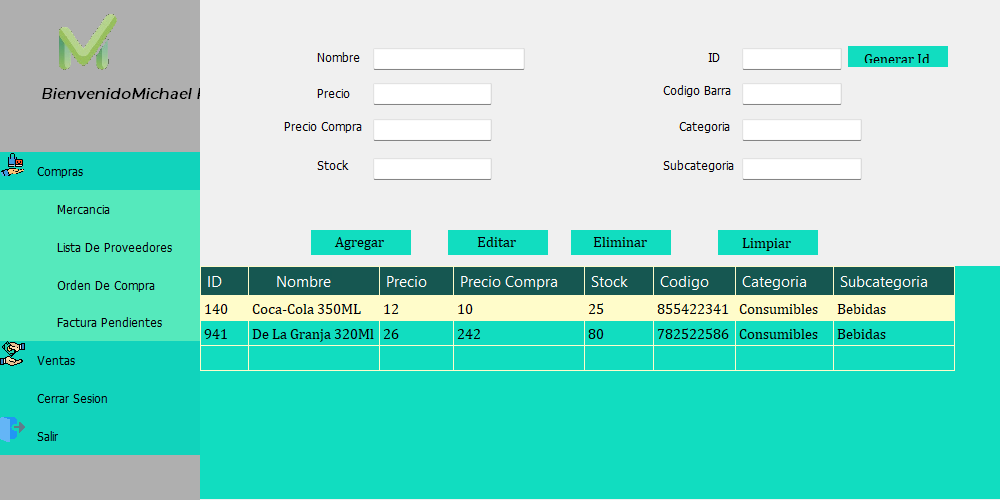
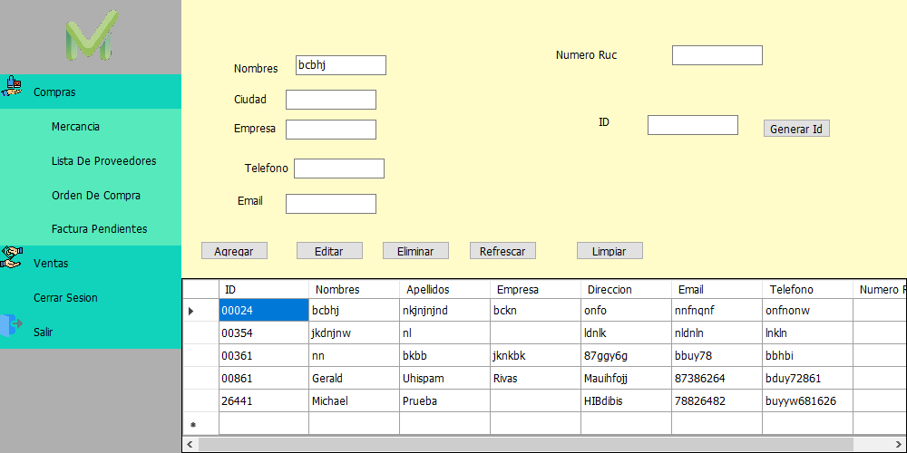

# SistemaDeInventario
Sistema de Inventario y manejo de clientes, realizado con Visual Basic y base de datos No Relacional almacenada en Firebase. Utilizando el modelo MVC.

LOGIN

INICIO

MENU DESPLEGABLE

MERCANCIAS

PROVEEDORES

